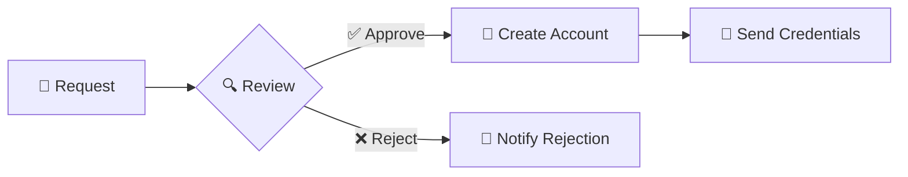

<p align="center">
  
</p>

<h1 align="center">🔐 SecurAuth+</h1>

<p align="center">
  <strong>Enterprise-Grade Identity & Access Management Platform</strong>
</p>

<p align="center">
  <a href="#-features">Features</a> •
  <a href="#-quick-start">Quick Start</a> •
  <a href="#-architecture">Architecture</a> •
  <a href="#-api-documentation">API</a> •
  <a href="#-screenshots">Screenshots</a> •
  <a href="#-license">License</a>
</p>

<p align="center">
  
  
  
  
</p>

<p align="center">
  
  
  
  
</p>

<p align="center">
  
  
  
</p>

---

## 📋 Table of Contents

<details>
<summary>Click to expand</summary>

- [🎯 Overview](#-overview)
- [✨ Features](#-features)
- [🏗️ Architecture](#️-architecture)
- [🚀 Quick Start](#-quick-start)
- [📖 API Documentation](#-api-documentation)
- [🔐 Security Features](#-security-features)
- [👥 Role-Based Access Control](#-role-based-access-control)
- [📊 Audit & Compliance](#-audit--compliance)
- [🖼️ Screenshots](#️-screenshots)
- [🛠️ Tech Stack](#️-tech-stack)
- [📁 Project Structure](#-project-structure)
- [🤝 Contributing](#-contributing)
- [📄 License](#-license)

</details>

---

## 🎯 Overview

**SecurAuth** is a comprehensive **Identity and Access Management (IAM)** platform designed for modern enterprises. It provides centralized user management, robust authentication mechanisms, granular access control, and complete audit trails.

### 🎪 Key Highlights

| Feature | Description |
|---------|-------------|
| 🔑 **Centralized Identity** | Manage all users from a single dashboard |
| 🛡️ **Multi-Factor Auth** | Google Authenticator TOTP integration |
| 👮 **RBAC** | Granular role-based permissions |
| 📝 **Full Audit Trail** | Track every action with detailed logs |
| 🔄 **Self-Service** | Users manage their own security settings |
| 📧 **Email Notifications** | Automated alerts and notifications |

---

## ✨ Features

### 🔐 Authentication & Security

<table>
<tr>
<td width="50%">

#### JWT Authentication
- ⚡ Access Token (1 hour validity)
- 🔄 Refresh Token (7 days validity)
- 🚫 Token revocation on logout
- 🔒 Secure token storage

</td>
<td width="50%">

#### Two-Factor Authentication
- 📱 Google Authenticator support
- 🔢 TOTP (RFC 6238 compliant)
- 📷 QR Code generation
- ✅ Easy enable/disable

</td>
</tr>
<tr>
<td width="50%">

#### Password Security
- 🔐 BCrypt hashing with salt
- 📏 Complexity requirements
- 🕐 Password history (last 5)
- ⏰ Forced change on first login

</td>
<td width="50%">

#### Account Protection
- 🚫 Auto-lock after 3 failed attempts
- 🔓 Admin unlock capability
- 📍 IP & User-Agent tracking
- 🛑 Session management

</td>
</tr>
</table>

### 👥 User Management

```
┌─────────────────────────────────────────────────────────────┐
│                    USER LIFECYCLE                            │
├─────────────────────────────────────────────────────────────┤
│  📝 Registration    →  ✅ Approval  →  🔐 Activation        │
│       ↓                    ↓               ↓                 │
│  📧 Notification    ←  👤 Admin     →  🎉 Welcome Email     │
└─────────────────────────────────────────────────────────────┘
```

- ➕ Create users with auto-generated credentials
- ✏️ Edit user profiles and roles
- 🔄 Enable/Disable accounts
- 🔓 Unlock locked accounts
- 🔑 Reset passwords
- 🗑️ Delete users

### 📋 Registration Workflow



### 📊 Audit Logs

| Action | Details Captured |
|--------|------------------|
| `LOGIN_SUCCESS` | User, IP, Timestamp, User-Agent |
| `LOGIN_FAILED` | Username, IP, Reason, Attempt Count |
| `USER_CREATED` | Created By, User Details |
| `PASSWORD_CHANGED` | User, Changed By |
| `2FA_ENABLED` | User, Timestamp |
| `SESSION_TERMINATED` | User, Session ID, Terminated By |

---

## 🏗️ Architecture

```
┌────────────────────────────────────────────────────────────────┐
│                         CLIENT LAYER                            │
│  ┌─────────────┐  ┌─────────────┐  ┌─────────────┐             │
│  │   React     │  │   Postman   │  │  3rd Party  │             │
│  │  Frontend   │  │   Client    │  │    Apps     │             │
│  └──────┬──────┘  └──────┬──────┘  └──────┬──────┘             │
└─────────┼────────────────┼────────────────┼────────────────────┘
          │                │                │
          ▼                ▼                ▼
┌────────────────────────────────────────────────────────────────┐
│                        API GATEWAY                              │
│  ┌──────────────────────────────────────────────────────────┐  │
│  │              Spring Security + JWT Filter                 │  │
│  └──────────────────────────────────────────────────────────┘  │
└────────────────────────────────────────────────────────────────┘
          │
          ▼
┌────────────────────────────────────────────────────────────────┐
│                      BACKEND SERVICES                           │
│  ┌──────────┐ ┌──────────┐ ┌──────────┐ ┌──────────┐          │
│  │   Auth   │ │   User   │ │   Role   │ │  Audit   │          │
│  │ Service  │ │ Service  │ │ Service  │ │ Service  │          │
│  └────┬─────┘ └────┬─────┘ └────┬─────┘ └────┬─────┘          │
└───────┼────────────┼────────────┼────────────┼─────────────────┘
        │            │            │            │
        ▼            ▼            ▼            ▼
┌────────────────────────────────────────────────────────────────┐
│                       DATA LAYER                                │
│  ┌──────────────────────────────────────────────────────────┐  │
│  │                    PostgreSQL                             │  │
│  │    Users │ Roles │ Sessions │ Audit Logs │ API Keys      │  │
│  └──────────────────────────────────────────────────────────┘  │
└────────────────────────────────────────────────────────────────┘
```

---

## 🚀 Quick Start

### Prerequisites

| Requirement | Version |
|-------------|---------|
| ☕ Java | 17+ |
| 📦 Maven | 3.8+ |
| 🐘 PostgreSQL | 14+ |
| 📗 Node.js | 18+ |
| 📦 npm | 9+ |

### ⚡ One-Click Setup (Windows)

```powershell
# Clone the repository
git clone https://github.com/Azzammoo10/SecurAuth.git
cd SecurAuth

# Run setup script
.\setup.ps1
```

### 🔧 Manual Setup

<details>
<summary><strong>1️⃣ Database Setup</strong></summary>

```sql
-- Create database
CREATE DATABASE secureauth;

-- Run migrations
\i database/init.sql
\i database/migration_add_iam_features.sql
```

</details>

<details>
<summary><strong>2️⃣ Backend Setup</strong></summary>

```bash
cd backend

# Configure application.yml with your database credentials

# Build and run
mvn clean install
mvn spring-boot:run
```

Backend will start at: `http://localhost:8080`

</details>

<details>
<summary><strong>3️⃣ Frontend Setup</strong></summary>

```bash
cd frontend

# Install dependencies
npm install

# Start development server
npm run dev
```

Frontend will start at: `http://localhost:5173`

</details>

### 🔑 Default Credentials

| Role | Username | Password |
|------|----------|----------|
| 👑 Admin | `admin` | `Admin@123` |
| 👮 Security | `security` | `Security@123` |
| 📊 Manager | `manager` | `Manager@123` |
| 👤 User | `user` | `User@123` |

> ⚠️ **Important**: Change default passwords after first login!

---

## 📖 API Documentation

### 🌐 Base URL

```
http://localhost:8080/api/v1
```

### 🔗 Endpoints Overview

<details>
<summary><strong>🔐 Authentication</strong></summary>

| Method | Endpoint | Description |
|--------|----------|-------------|
| `POST` | `/auth/login` | User login |
| `POST` | `/auth/logout` | User logout |
| `POST` | `/auth/refresh` | Refresh access token |
| `POST` | `/auth/verify-2fa` | Verify 2FA code |
| `POST` | `/auth/register` | Public registration request |

</details>

<details>
<summary><strong>👥 Users</strong></summary>

| Method | Endpoint | Description | Role |
|--------|----------|-------------|------|
| `GET` | `/users` | List all users | ADMIN, MANAGER |
| `POST` | `/users` | Create user | ADMIN |
| `GET` | `/users/{id}` | Get user by ID | ADMIN, MANAGER |
| `PUT` | `/users/{id}` | Update user | ADMIN |
| `DELETE` | `/users/{id}` | Delete user | ADMIN |
| `PATCH` | `/users/{id}/toggle-status` | Enable/Disable | ADMIN |
| `PATCH` | `/users/{id}/unlock` | Unlock account | ADMIN |
| `POST` | `/users/{id}/reset-password` | Reset password | ADMIN |

</details>

<details>
<summary><strong>🎭 Roles</strong></summary>

| Method | Endpoint | Description | Role |
|--------|----------|-------------|------|
| `GET` | `/roles` | List all roles | ADMIN |
| `POST` | `/roles` | Create role | ADMIN |
| `PUT` | `/roles/{id}` | Update role | ADMIN |
| `DELETE` | `/roles/{id}` | Delete role | ADMIN |

</details>

<details>
<summary><strong>📋 Registrations</strong></summary>

| Method | Endpoint | Description | Role |
|--------|----------|-------------|------|
| `GET` | `/registrations` | List requests | ADMIN |
| `POST` | `/registrations/{id}/approve` | Approve request | ADMIN |
| `POST` | `/registrations/{id}/reject` | Reject request | ADMIN |

</details>

<details>
<summary><strong>📊 Audit Logs</strong></summary>

| Method | Endpoint | Description | Role |
|--------|----------|-------------|------|
| `GET` | `/audit` | List audit logs | ADMIN, SECURITY |
| `GET` | `/audit/stats` | Get statistics | ADMIN, SECURITY |
| `POST` | `/audit/export` | Export logs | ADMIN, SECURITY |

</details>

### 📬 Postman Collection

Import the collection for easy testing:

```
postman/SecureAuth_API.postman_collection.json
```

[](https://www.postman.com/)

---

## 🔐 Security Features

### 🛡️ Security Layers

```
┌─────────────────────────────────────────────────────────┐
│                    SECURITY STACK                        │
├─────────────────────────────────────────────────────────┤
│  Layer 1: HTTPS/TLS Encryption                          │
├─────────────────────────────────────────────────────────┤
│  Layer 2: JWT Token Authentication                      │
├─────────────────────────────────────────────────────────┤
│  Layer 3: Two-Factor Authentication (TOTP)              │
├─────────────────────────────────────────────────────────┤
│  Layer 4: Role-Based Access Control (RBAC)              │
├─────────────────────────────────────────────────────────┤
│  Layer 5: Password Policy Enforcement                   │
├─────────────────────────────────────────────────────────┤
│  Layer 6: Account Lockout Protection                    │
├─────────────────────────────────────────────────────────┤
│  Layer 7: Session Management                            │
├─────────────────────────────────────────────────────────┤
│  Layer 8: Complete Audit Trail                          │
└─────────────────────────────────────────────────────────┘
```

### 🔒 Password Requirements

- ✅ Minimum 8 characters
- ✅ At least 1 uppercase letter
- ✅ At least 1 lowercase letter
- ✅ At least 1 number
- ✅ At least 1 special character (!@#$%^&*)
- ✅ Cannot reuse last 5 passwords

### 📱 2FA Setup with Google Authenticator

1. Navigate to **Account Security** → **Two-Factor Authentication**
2. Click **Enable 2FA**
3. Scan QR code with Google Authenticator
4. Enter 6-digit verification code
5. ✅ 2FA is now active!

---

## 👥 Role-Based Access Control

### 📊 Role Hierarchy

```
         ┌─────────┐
         │  ADMIN  │  ← Full system access
         └────┬────┘
              │
    ┌─────────┴─────────┐
    │                   │
┌───┴───┐         ┌─────┴─────┐
│MANAGER│         │ SECURITY  │
└───┬───┘         └─────┬─────┘
    │                   │
    │    User & Role    │    Audit & Security
    │    Management     │    Monitoring
    │                   │
    └─────────┬─────────┘
              │
         ┌────┴────┐
         │  USER   │  ← Basic access
         └─────────┘
```

### 🎭 Role Permissions

| Permission | ADMIN | SECURITY | MANAGER | USER |
|------------|:-----:|:--------:|:-------:|:----:|
| View Dashboard | ✅ | ✅ | ✅ | ✅ |
| Manage Users | ✅ | ❌ | ✅* | ❌ |
| Manage Roles | ✅ | ❌ | ❌ | ❌ |
| View Audit Logs | ✅ | ✅ | ❌ | ❌ |
| Export Audit Logs | ✅ | ✅ | ❌ | ❌ |
| Security Settings | ✅ | ✅ | ❌ | ❌ |
| Approve Registrations | ✅ | ❌ | ❌ | ❌ |
| API Key Management | ✅ | ✅ | ✅ | ✅ |

> *MANAGER can only manage USER role accounts

---

## 📊 Audit & Compliance

### 📝 Tracked Events

| Category | Events |
|----------|--------|
| 🔐 **Authentication** | Login, Logout, Failed Attempts, 2FA Verification |
| 👤 **User Management** | Create, Update, Delete, Enable, Disable, Unlock |
| 🔑 **Password** | Change, Reset, Force Change |
| 🎭 **Roles** | Assign, Remove, Create, Delete |
| 📱 **2FA** | Enable, Disable, Verify |
| 🔗 **Sessions** | Create, Terminate, Expire |
| 🔑 **API Keys** | Generate, Revoke |

### 📈 Compliance Ready

- ✅ **GDPR** - Article 30 compliant logging
- ✅ **SOX** - Complete audit trail
- ✅ **ISO 27001** - Access control standards
- ✅ **HIPAA** - Security safeguards

---

## 🖼️ Screenshots

<details>
<summary><strong>🖥️ View Screenshots</strong></summary>

### 🔐 Login Page
Modern split-screen design with animated branding

### 📊 Dashboard
Real-time statistics and quick actions

### 👥 User Management
Complete CRUD operations with role assignment

### 📋 Audit Logs
Advanced filtering and export capabilities

### 🔒 Account Security
2FA setup, session management, API keys

</details>

---

## 🛠️ Tech Stack

### Backend

| Technology | Purpose |
|------------|---------|
|  | Core Language |
|  | Framework |
|  | Authentication & Authorization |
|  | Database |
|  | Token Authentication |
|  | Build Tool |

### Frontend

| Technology | Purpose |
|------------|---------|
|  | UI Framework |
|  | Build Tool |
|  | Styling |
|  | HTTP Client |

---

## 📁 Project Structure

```
SecurAuth/
├── 📁 backend/
│   ├── 📁 src/main/java/com/secureauth/
│   │   ├── 📁 config/          # Security & JWT config
│   │   ├── 📁 controllers/     # REST endpoints
│   │   ├── 📁 dto/             # Data transfer objects
│   │   ├── 📁 entities/        # JPA entities
│   │   ├── 📁 exceptions/      # Custom exceptions
│   │   ├── 📁 repositories/    # Data access layer
│   │   └── 📁 services/        # Business logic
│   ├── 📁 src/main/resources/
│   │   └── 📄 application.yml  # Configuration
│   └── 📄 pom.xml
│
├── 📁 frontend/
│   ├── 📁 src/
│   │   ├── 📁 components/      # Reusable components
│   │   ├── 📁 pages/           # Page components
│   │   ├── 📁 services/        # API services
│   │   ├── 📁 styles/          # CSS files
│   │   └── 📄 App.jsx          # Root component
│   ├── 📄 package.json
│   └── 📄 vite.config.js
│
├── 📁 database/
│   ├── 📄 init.sql             # Initial schema
│   └── 📄 migration_*.sql      # Migrations
│
├── 📁 postman/
│   └── 📄 SecureAuth_API.postman_collection.json
│
├── 📄 README.md
├── 📄 INSTALLATION.md
├── 📄 QUICKSTART.md
└── 📄 setup.ps1
```


# 👤 Contributeurs

**MAJGHIROU Mohamed Riyad**

- GitHub: [@riyad4589](https://github.com/riyad4589)
- Email: [riyadmaj10@gmail.com](mailto:riyadmaj10@gmail.com)
- LinkedIn: [Mohamed Riyad MAJGHIROU](https://www.linkedin.com/in/mohamed-riyad-majghirou-5b62aa388/)


**AZZAM Mohamed**

- GitHub: [@Azzammoo10](https://github.com/Azzammoo10)
- Email: [azzam.moo10@gmail.com](mailto:azzam.moo10@gmail.com)
- LinkedIn: [Mohamed AZZAM](https://www.linkedin.com/in/mohamed-azzam-93115823a/)

---


<p align="center">
  <a href="https://github.com/Azzammoo10/SecurAuth/issues">🐛 Report Bug</a> •
  <a href="https://github.com/Azzammoo10/SecurAuth/issues">✨ Request Feature</a> •
  <a href="https://github.com/Azzammoo10/SecurAuth/wiki">📖 Documentation</a>
</p>

<p align="center">
  <strong>⭐ Star this repo if you find it helpful!</strong>
</p>

<p align="center">
</p>
